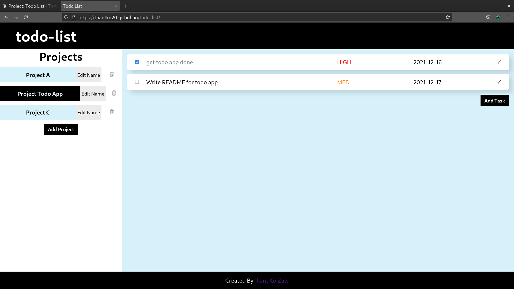
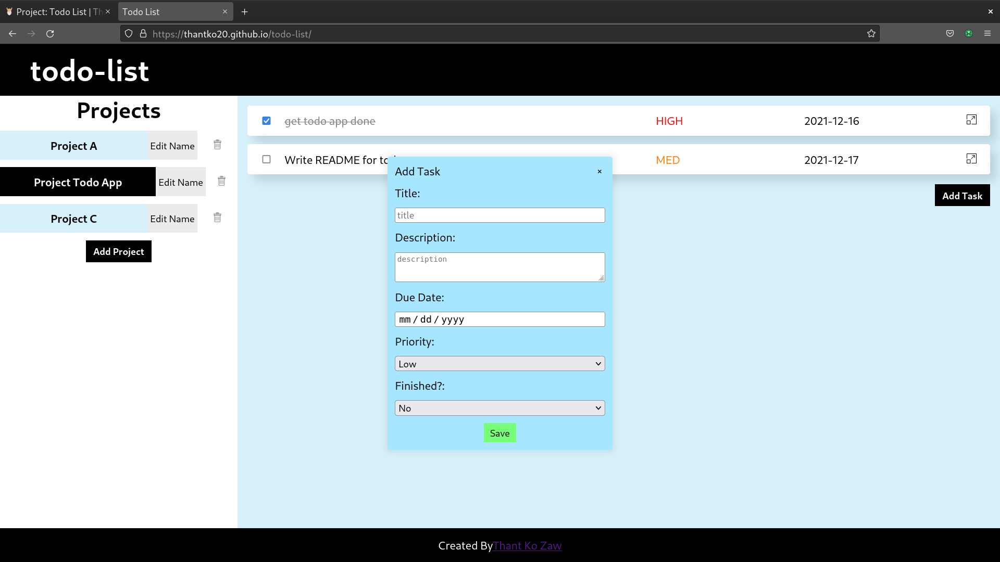
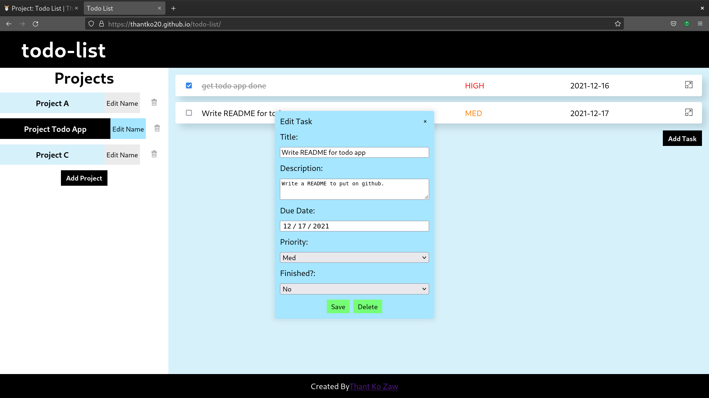

# Todo List

Made this project as part of [The Odin Project](https://www.theodinproject.com/).

## Live Link

View on [github pages](https://thantko20.github.io/todo-list/).

## Features

- Add projects
- Switch between different projects
- Edit projects' names
- Delete projects

- Add Tasks

- Edit and delete tasks

## Weaknesses

1. Won't be able to view tasks based on date/time.
2. Users may not find the design very eye-catching.
3. As for code, I did make as many modules as I could. But I'm willing to improve it.